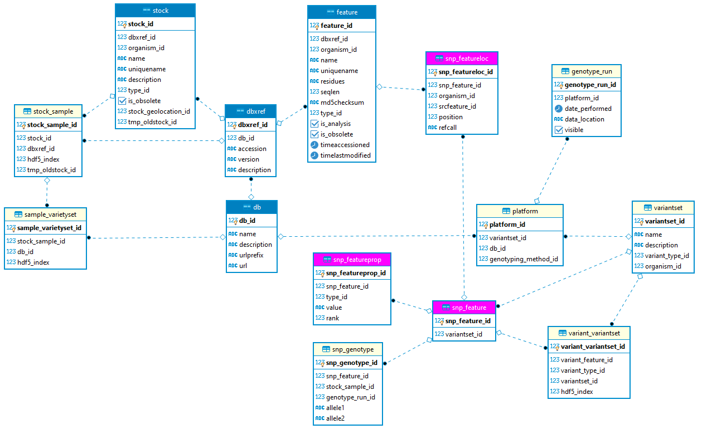

# README #

### What is this repository for? ###
 
 This repository is forked from the Rice SNP-Seek source code at [http://bitbucket.org/irridev/iric_portal](http://bitbucket.org/irridev/iric_portal). The major changes include support for multiple references, and option for the Genotype Viewer to display only basic components suitable for embedded application.
 This also includes VCF file processing and loading scripts to the database.
   
[//]: #( Modifications and new resources developed for CannSeek [https://icgrc.info/cannseek](https://icgrc.info/cannseek).)
[//]: #(This fork version is hosted at Github [https://github.com/locmansueto/SNPSeekWithZKChartGH](https://github.com/locmansueto/SNPSeekWithZKChartGH))

### VCF file processing and loading ###

The scripts in the `loading_scripts` folder are used to load genotype data into the database given a VCF file.

&nbsp;A. These software are required  
&nbsp;&nbsp;&nbsp;1. bcftools  
&nbsp;&nbsp;&nbsp;2. [SNPEff](https://pcingola.github.io/SnpEff/)    

&nbsp;B. Generate SNP effect annotations using SNPEff on the VCF file using the same reference and available predicted gene models. Follow the [SNPEff manual](https://pcingola.github.io/SnpEff/snpeff/running)

&nbsp;C. For VCF files with both SNPs and indels, filter to include SNPs only    
&nbsp;&nbsp;&nbsp;1. modify REF, VCFNAME and BCF in ``filter_snps.sh``. REF if reference fasta, VCF is vcf file path, BCF is bcftools path  
&nbsp;&nbsp;&nbsp;2. run ``filter_snps.sh``  
	
&nbsp;D. Process and filter (only HIGH,MODERATE, and LOW effects) SNPEff VCF result.  
&nbsp;&nbsp;&nbsp;1. modify VCFNAME and BCF in ``filter-highmodlow.py``. VCFNAME is path of SNP only vcf with SNPEff annotation. BCF is bcftools path  
&nbsp;&nbsp;&nbsp;2. run ``python filter-highmodlow.py``  
	
&nbsp;E. Generate HDF5 and csv files for loading  
&nbsp;&nbsp;&nbsp;1. modify VCFNAME, BCF and LOADMATRIX\_GENO in ``vcf2h5.sh``. VCFNAME is path of SNP only vcf, LOADMATRIX_GENO is path to ``loadmatrix_gene`` executable,  BCF is bcftools path  
&nbsp;&nbsp;&nbsp;2. run ``vcf2h5.sh``

	
&nbsp;F. Start SNP-Seek Postgres database server and from the Docker/Podman containers  
&nbsp;&nbsp;&nbsp;1. extract the archive cannseek-26trich.tgz
&nbsp;&nbsp;&nbsp;2. extract the archives cannseek_tomcat.tgz and cannseek_flatfiles.tgz  
&nbsp;&nbsp;&nbsp;3. modify the mapped volumes for postgres  in ``cannseek_start.sh`` to the archive directories in F.1  
&nbsp;&nbsp;&nbsp;4. modify the mapped volumes for tomcat in ``cannseek_start.sh`` to the archive directories in F.2  
&nbsp;&nbsp;&nbsp;5. run ``cannseek_start.sh``  

&nbsp;G. Load the SNPs data  
&nbsp;&nbsp;&nbsp;1. modify in ``load_snp.py`` the following variables:    
&nbsp;&nbsp;&nbsp;&nbsp;&nbsp;&nbsp;&nbsp;&nbsp;&nbsp;**dataset**  name of dataset (no space, use only alphanumeric or underscore )  
&nbsp;&nbsp;&nbsp;&nbsp;&nbsp;&nbsp;&nbsp;&nbsp;&nbsp;**samplesfile** samples file  (generated in E.2)  
&nbsp;&nbsp;&nbsp;&nbsp;&nbsp;&nbsp;&nbsp;&nbsp;&nbsp;**posfile** positions file (generated in E.2)  
&nbsp;&nbsp;&nbsp;&nbsp;&nbsp;&nbsp;&nbsp;&nbsp;&nbsp;**snpefffile** .misssyn.txt snpeffects file (concatenated from missense_variant.txt and synonymous_variant.txt files generated in D.2)   
&nbsp;&nbsp;&nbsp;&nbsp;&nbsp;&nbsp;&nbsp;&nbsp;&nbsp;**snpeffannotfile** .filtered.txt filtered SNP annotation file (generated in D.2)   
&nbsp;&nbsp;&nbsp;&nbsp;&nbsp;&nbsp;&nbsp;&nbsp;&nbsp;**organism_id** organism_id in database (3 for cs10 in the provided snapshot) 
&nbsp;&nbsp;&nbsp;2. copy the files defined in H.1 to the host directory mapped to container /transfer  
&nbsp;&nbsp;&nbsp;3. create symbolic links ``ln -s`` to the files in H.2 in the location of ``load_snp.py``    
&nbsp;&nbsp;&nbsp;4. modify the database connection dictionary connstr in ``load_snp.py`` if needed  
&nbsp;&nbsp;&nbsp;5. run ``python load_snp.py``	    
&nbsp;&nbsp;&nbsp;6. rename the .h5 file generated in E.2 to {dataset}_trans.h5 and copy to the TOMCAT host flatfile directory defined in F.4 	
	

### SNP-Seek documentation updates ###

This section supplements and an update to the original [README](README_ORIG.md).  

The SNPSeek database uses the Chado schema with modifications for efficient storage of genotyping datasets. In the diagram, the blue tables (db,dbxref,stock,feature) are part of the original Chado schema. The red tables (snp_feature, snp_featureloc, snp_featureprop) are derivatives of the original Chado tables (feature,featureloc,featureprop) specificaly for SNP features. 

