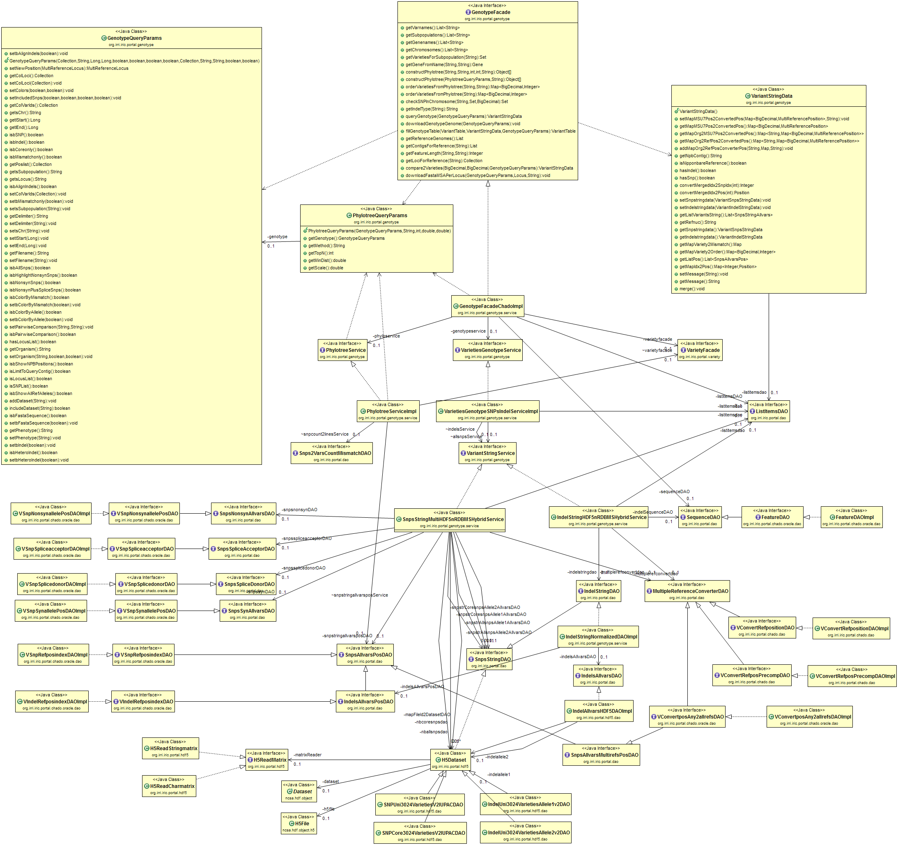
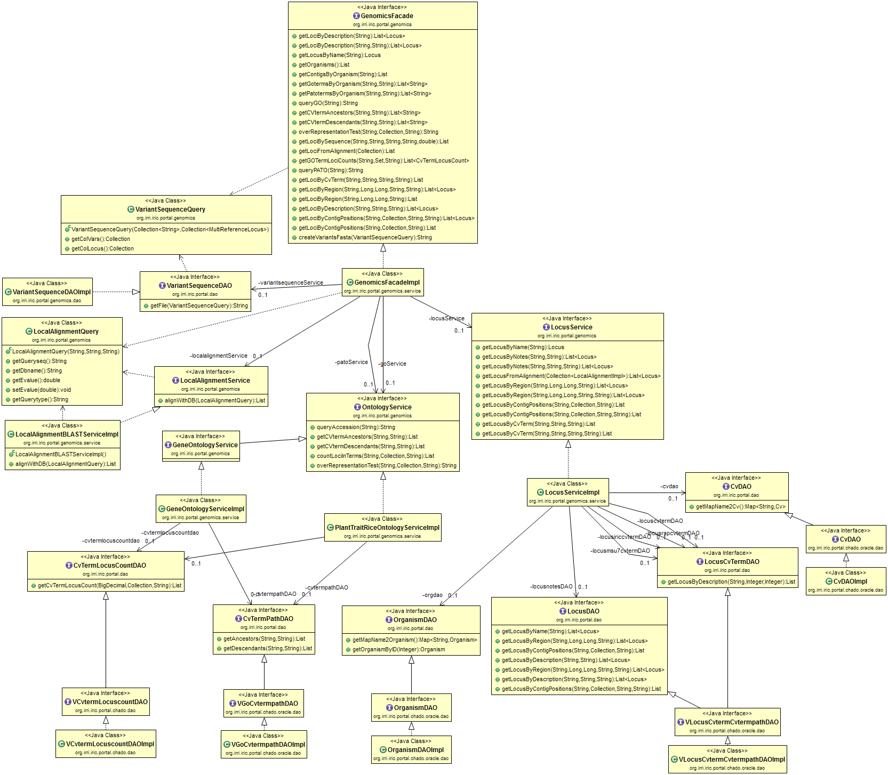
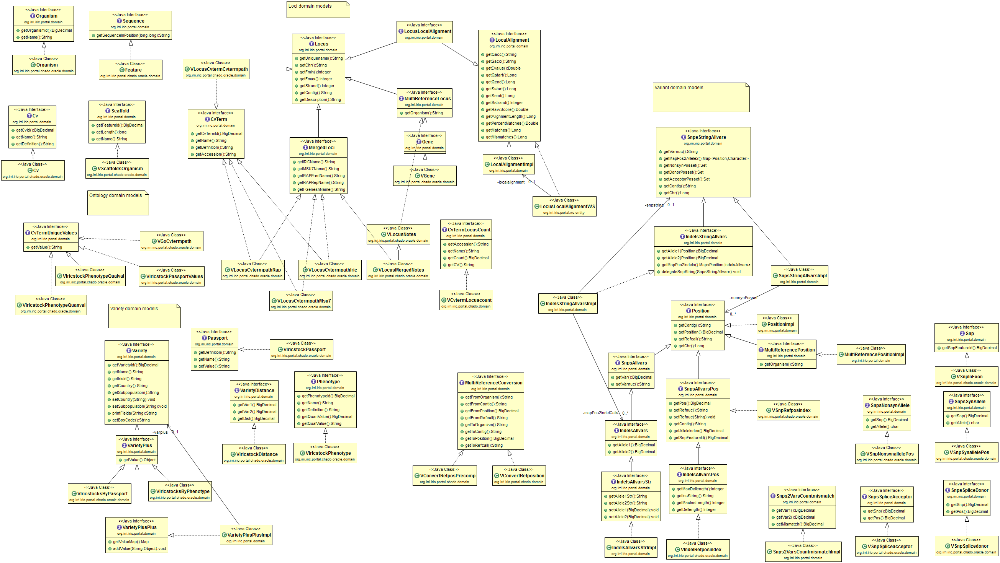
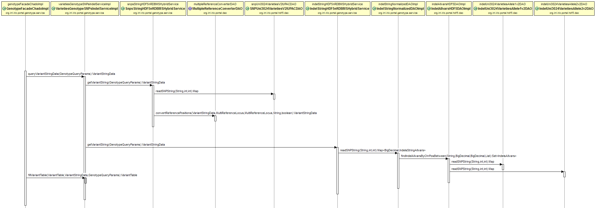

# README #

### What is this repository for? ###

This is the repository of IRIC-Portal Web interface. The application is written in Java, using Hibernate for ORM, Spring to manage the beans and configurations and ZK for the viewers. There are separate repositories for the backend Oracle and data generation pipeline scripts.

* Version 1
	* Updates are logged in [http://oryzasnp.org/iric-portal/_about.zul](http://oryzasnp.org/iric-portal/_about.zul "updates")

### How do I get set up? ###

* Setup  
	
	- Download the [HDF5 data files](https://s3.amazonaws.com/snp-seek/snpseekdata-4bitbucket.zip) and save them in a dedicated directory in the web server.
	- Download the [customized JBrowse](https://s3.amazonaws.com/snp-seek/jbrowse-1.11.6-4bitbucket.tgz), extract it in the webserver and create a symbolic link (ex. jbrowse) from the tomcat webapps directory pointing to the extracted JBrowse directory.
	- Download/Clone this project and open in Eclipse (or preferably MyEclipse). 
	- Set the database connection parameters in bean IRIC\_ProductionDS in /resources/iric\_prod\_crud-dao-context.xml (described next section)
	- Set the parameters defined in the static class org.irri.iric.portal.AppContext, specially:
	
			webserver				The target webserver. enum WEBSERVER { LOCALHOST, AWS, AWSDEV, VMIRRI, POLLUX, ASTI }
									Unless you are within IRRI network, just set this to the default LOCALHOST.
			compiletype				Compilation type. enum COMPILETYPE { PROD, DEV, TEST }
			getFlatfilesDir()	 	Directory of SNP-Seek data files in the server (using server file system) 
			getHostname()			Web server hostname or IP address 
			getTempDir()			Directory to write temp files accessible to the internet, but using the server file system (ex. /path/to/tomcat/webapps/temp)
			getJbrowseDir() 		JBrowse folder name as deployed in web server (ex. jbrowse)
		
		These configurations are currently hard-coded, but will be made configurable through XML later.  

	- Compile the application and export into a war file. (ex. iric-portal.war)

	- Download and install the HDF5 library from [https://www.hdfgroup.org/HDF5/release/obtain5.html](https://www.hdfgroup.org/HDF5/release/obtain5.html "HDF5 library") (also available [here](https://s3.amazonaws.com/snp-seek/hdf5lib.zip)) in the web server. Add the HDF5 library installation directory to Tomcat. In /path/to/tomcat/bin/setenv.sh add the line
	
			export JAVA_OPTS="-Djava.library.path=/path/to/hdf5/lib"

		Within Eclipse, set it in Run>Run configuration>Server>Tomcat, select Arguments tab, VM arguments textbox 
	
	- Deploy the generated war in Tomcat
	- Set a cron job to regularly empty the directory defined in getTempDir() 
	
  
* Dependencies    
	Aside from the downloads described above, all required jar files are included in the project in /WebRoot/WEB-INF/lib

* Database configuration  
	To connect to the database, edit the username, password and url for the Data Source Setup in the file /resources/iric\_prod\_crud-dao-context.xml. Please contact us for these values, with your development machine IP address.

		<class="org.apache.commons.dbcp.BasicDataSource" destroy-method="close" name="IRIC_ProductionDS">
			<property name="driverClassName" value="oracle.jdbc.driver.OracleDriver"/>
			<property name="username" value="*"/>
			<property name="password" value="*"/>
			<property name="url" value="jdbc:oracle:thin:@*"/>
			<property name="maxIdle" value="16"/>
			<property name="maxActive" value="32"/>
		</bean>

### Eclipse Project organization ###

The project files are organized in these folders and packages. Javadoc documentation is also available in [http://oryzasnp.org/snpseek-javadoc/](http://oryzasnp.org/snpseek-javadoc/)

* /src   
	the source code	organized into java packages described below. The packages are organized as descibed with the UML class diagrams in /uml
* /src/applicationContext-business.xml    
	The configuration files defined in /resources are imported in sequence as defined in this file. When a new package is created, it should be registered in this file and in this order: 
		
		Domains, DAOs, Service, Web or WS or ZK Controllers
to makes sure that the Spring dependency injection works without NULL reference assignments
* /resources    
	configuration files.
		
		iric_prod_crud-dao-context.xml
		iric_prod_crud-security-context.xml
		iric_prod_crud-service-context.xml
		iric_prod_crud-web-context.xml
* /uml
	UML class diagram files
* /doc	
	source code documentation generated by Javadoc
* /WebRoot/WEB-INF/applicationContext-security.xml      
	Spring-security configuration
* /WebRoot   
	Root directory of the web application, as viewed in the browser. We are using ZK for the viewers and the webpages are defined in *zul files, instead of html. The most important files are:

		genotype.zul	SNP query page
		variety.zul		Variety query page
		locus.zul		Gene loci query page
		download.zul	Download page
		myworkspace.zul	My List page
		gwas.zul		GWAS analysis page
		home.zul		Front page
	

	The web layout is defined by these files
		
		index.zul		Landing/default page
		template.zul	Page layout
		banner.zul		Banner and menu page
		footer.zul		Footer page	
		_*				files starting with _ are the corresponding decorators to apply the template to the pages
	
* README.md   this file
	

### Source code organization and software architecture  ###

The Java source codes are organized into these major packages  

		org.irri.iric.portal			global configurations, utility functions
		org.irri.iric.portal.domain		domain objects interface, used by all services
		org.irri.iric.portal.dao		data access object interface, used by all services
		org.irri.iric.portal.genotype	SNPs and Indels queries
		org.irri.iric.portal.variety	variety phenotype and passport data queries
		org.irri.iric.portal.genomics	gene loci, gene ontology queries
		org.irri.iric.portal.gwas		GWAS analysis modules 
		org.irri.iric.portal.chado.oracle		DAO and Domain implementation for data stored in Oracle using Chado schema
		org.irri.iric.portal.hdf5		DAO and Domain implementation for data stored in HDF5 format
		org.irri.iric.portal.ws			web services
		org.irri.iric.portal.admin		manages workspace, users

* Service

The web application follows the Model-View-Controller (MVC) architecture. There are currently four major functionalities of the application: genotype query, variety query, gene loci query and user workspace management, which is organized in:

		org.irri.iric.portal.genotype
		org.irri.iric.portal.variety
		org.irri.iric.portal.genomics
		org.irri.iric.portal.admin

Within these packages are  **.service**  and **.zkui** subpakages. Each service has a facade interface, which serves as an entry point for the domain. To make the user interfaces, web interfaces and WS-API independent of the actual data sources, the viewers, controllers or web services should use only these Facade interfaces:

		org.irri.iric.portal.genotype.service.GenotypeFacade
		org.irri.iric.portal.variety.service.VarietyFacade
		org.irri.iric.portal.genomics.service.GenomicsFacade
		org.irri.iric.portal.admin.WorkspaceFacade

Each method of these facade call other **Service** objects, which implements the query logic. The service objects then use **DAO** or data access object interfaces to query the database.  

* Views

Our web interface use the ZK framework [http://www.zkoss.org/](http://www.zkoss.org/ "ZK framework"). The view controllers are in the **org.irri.iric.portal.\*.zkui** packages which include the ZK view controller and supporting classes for the components (buttons, listboxes, tables, checkboxes, etc.) in the user interface. The interface termplate itself is defined in the *.zul files in /WebRoot
 

* Web service

The web services API are implemented using Spring REST Controller to map URL paths to service and  facade methods. There are currently three major web services:

		org.irri.iric.portal.ws.rest.GenotypeWS		For methods in *GenotypeFacade
		org.irri.iric.portal.ws.rest.VarietyWS 		For methods in *VarietyFacade
		org.irri.iric.portal.ws.rest.BlastWS		For methods in *LocalAlignmentService

To hide or add more attributes, or change data types to the response objects, WS-specific entities are implemented to wrap the DAO-generated entities. These web service response objects are defined in **org.irri.iric.portal.ws.entity**

The WADL file [http://oryzasnp.org/iric-portal/ws/application.wadl](http://oryzasnp.org/iric-portal/ws/application.wadl "WADL") which can be used to generate client objects, is generated automatically by Spring from the defined mappings. This file is also used to generate the API documentation. The file /WebRoot/api-docs/application-api-docs.json is such documentation in Swagger-json format, can be viewed by swagger-ui in [http://oryzasnp.org/iric-portal/swagger-ui/index.html](http://oryzasnp.org/iric-portal/swagger-ui/index.html "swagger-ui")   

* Data stores

Every data store should implement the Domain and DAO interfaces for each data it can provide. These are the currently implemented data stores:

		org.irri.iric.portal.chado.*	To access Oracle with Chado schema
		org.irri.iric.portal.hdf5.*		To read HDF5 genotype files
		org.irri.iric.portal.flatfile.*	To read ASCII genotype files
	
Within these packages are subpackages:

		*dao 		where the actual data retrieval is implemented, like SQL query or file reading
		*domain 	holds the entity attribute values
	
* Utility classes

These are classes that are frequently used by all the modules.

		org.irri.iric.portal.AppContext	This class provides application-wide access to the Spring ApplicationContext. 
										It is used to define global application parameters. These parameters are currently hard-coded,
										but has the capability to be overriden with *.xml defined values.
		org.irri.iric.portal.dao.ListItemsDAO, org.irri.iric.portal.dao.ListItemsDAOImpl
										Iterface and an implementation to cache list of objects frequently used by the user-interface.
										The values are loaded from the database on first used, and then stored in a Map for fast access on next use.

* SNP-Seek Software Architecture

This diagram summarizes the different software layers and modules for the web-application.

* UML diagrams

The relationships between the components for each modules are illustrated in the following UML diagrams.

Genotype Module

Variety Module

Genomics Module

Domain Models 

Genotype Query Sequence

### Embedded external sites

* [JBrowse]([http://jbrowse.org](http://jbrowse.org)) is a browser-based genome browser implemented in javascript. We added some scripts for the Genotype track to display variants for all varieties within a region. The JBrowse script with the added codes and SNP-seek data are in [here](https://s3.amazonaws.com/snp-seek/jbrowse-1.11.6-4bitbucket.tgz).   

* [Vista]([http://pipeline.lbl.gov/cgi-bin/gateway2](http://pipeline.lbl.gov/cgi-bin/gateway2)) is a comparative genomics tool with its own viewer. We used Vista to compare the 5 reference genomes, and the results made viewable within SNP-Seek.

### Embedded internal sites

Some pages are generated using Java Server Pages (JSP) and embedded as IFrame to the ZK pages. The reason is that these pages extensively use javascript libraries that may conflict with ZK, which itself is in javascript. These include:

- /jsp/phylotreeGermplasm.jsp		Phylogenetic tree viewer
- /jsp/jsav.jsp						Multiple alignment viewer

### Get started with development

To start a new module, we created a set of files to start with as templates. 

1. Copy these files then rename to the module name.

		blank_module.zul
		_blank_module.zul

	The blank_module page uses the BlankModuleFacade defined in the  **org.irri.iric.portal.blank\_module** package. Copy then modify these into a new package using your module name. 
2. As a convention, create subpackages **org.irri.iric.portal.blank\_module.service**, **org.irri.iric.portal.blank\_module.dao** and  **org.irri.iric.portal.blank\_module.domain**  
3. Implement **org.irri.iric.portal.blank\_module.BlankModuleFacade** in the service subpackage, example **org.irri.iric.portal.blank\_module.BlankModuleFacadeImpl**. Implement all data Access Objects (DAO) related to this module in the DAO subpackage. The DAO's should implement DAO interfaces defined in **org.irri.iric.portal.dao**.    
4. Implement the Domain entities for the DAO's above in **org.irri.iric.portal.blank\_module.domain**. The domain entities should implement the interfaces defined in **org.irri.iric.portal.domain**. Register the new domain implementations in '/resources/META-INF/persistence.xml'.
5. Write codes to implement business logic methods in **org.irri.iric.portal.blank\_module.BlankModuleFacadeImpl**. For complex modules, you can divide the module into submodules as separate Services. In the service layer codes, **PROGRAM BY INTERFACE**, that is, use only the Interfaces defined in **org.irri.iric.portal.dao** and **org.irri.iric.portal.domain** for variable declarations, instead of the concrete implementations.
6. You may define new interfaces in **org.irri.iric.portal.dao** or **org.irri.iric.portal.domain** when necessary, but this has to be discussed with the team beforehand.        

### Source code repository

The source code is stored in BitBucket using git version control. This section is a short introduction on how to clone and contribute to the code. For users unfamiliar with git, please check this [tutorial](https://confluence.atlassian.com/bitbucket/git-tutorial-keep-track-of-your-space-station-locations-759857287.html).

* Cloning a Git repository

You can use Sourcetree, GitBash, or any client you like to clone your Git repository.  These instructions show you how to clone your repository with GitBash.

1. Navigate to the repository in Bitbucket.
2. Click the Clone button.
3. Copy the clone command (either the SSH format or the HTTPS). If you are using the SSH protocol, you must make sure your public key is in Bitbucket and loaded on the local system you are cloning to.
4. Launch a GitBash terminal.
5. Change to the local directory where you want to clone your Bitbucket repository.
6. Paste the command you copied from Bitbucket, for example:

		$git clone git@bitbucket.org/irridev/iric_portal.git

If you were successful, a new sub-directory appears on your local drive. This directory has the same name as the Bitbucket repository that you cloned. The clone contains the files and metadata that Git requires to maintain the changes you make to the source files.

* Using Git to checkout a branch on the command line

On your local system, make sure you have a local repository cloned from the remote repository. Then, do the following:

1. Change to the root of the local repository.
		
		cd mytestproject
2. List all your branches
 
		git branch -a 
You should see something similar to the following:

		* master
		  remotes/origin/HEAD -> origin/master
		  remotes/origin/feature
		  remotes/origin/master
Notice that it lists both the branches that are local and the remote branches  on Bitbucket. Using the list as reference, choose the branch you want to checkout.  In this example, the feature branch is the branch.

3. Checkout the branch you want to use.
			
		git checkout feature

4. Confirm you are now working on that branch:
		
		git branch
	You should see something similar to the following:

		git branch
		* feature
		  master

Going forward, all your Git commands apply to the branch. When you push the changes to your remote Bitbucket repository, those changes apply to the repository's branch.

* Git Commit Example – Updating ALL files in the local repository

	1. Enter `git add .` at the command line prompt in your local project directory, to stage files for commit.
	2. Enter `git commit –m “Commit message here.”` to update the files in your local repository

* Git push example – Updating files in the server
	1. Enter `git push` at the command line prompt in your local project directory, to copy your files from your local repository to Bitbucket.
	2. When prompted for authentication, enter your Bitbucket username and password.

Example:

	$ git push
	Password:
	Counting objects: 6, done.
	Delta compression using up to 4 threads.
	Compressing objects: 100% (3/3), done.
	Writing objects: 100% (4/4), 23.98 KiB, done.
	Total 4 (delta 0), reused 0 (delta 0)
	remote: bb/acl: alui is allowed. accepted payload.
	To https://alui@staging.bitbucket.org/alui/alui-git-fork.git
	   0ad86b3..395d3c2  master -> master

Open your Bitbucket repository in your browser. The Overview tab shows your most recent commits in the activity stream.

* Pull request

As this is better explained here, please see this [page](https://www.atlassian.com/git/tutorials/making-a-pull-request)

* Git Workflow

This is quite complex to discuss in a single paragraph, please refer to this [link](https://www.atlassian.com/git/tutorials/comparing-workflows/gitflow-workflow).

Using this workflow won’t really give much benefit for a single-developer project. But the more developers we add, the higher the need for organizing our workflow. So in case we get 2 or more people working on the source code, please follow the Gitflow workflow.

### Who do I talk to? ###

For comments and suggestions, please email us at iric@irri.org
